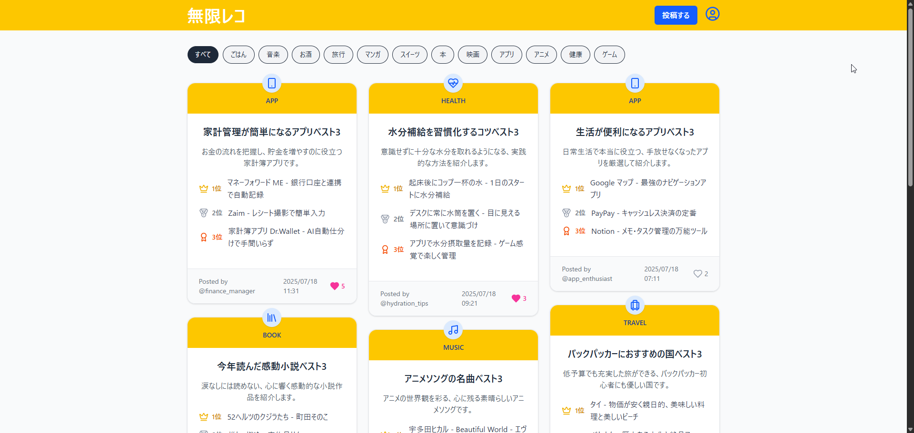
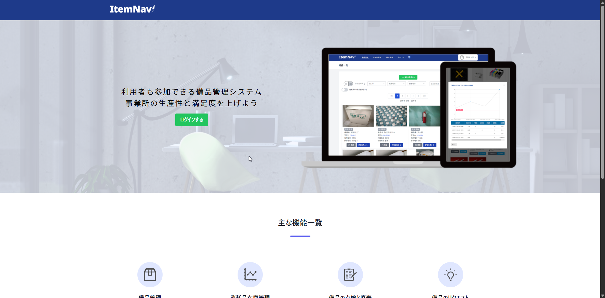

# ポートフォリオ一覧

- 未経験からWebエンジニアを目指して制作したポートフォリオアプリをまとめています
- [「waya」(Xアカウント: @waya_dev)」](https://x.com/waya_dev)によって作成されました

---

## 無限レコ（おすすめベスト3投稿アプリ）

- **技術スタック**:  
  React / FastAPI / AWS Lambda / DynamoDB / Serverless Framework  
- **主な機能**:  
  投稿 / コメント / いいね / 認証 / 無限スクロール  
- **GitHubリポジトリ**:  
  [→ https://github.com/waya-kkazuya/mugen-reco-portfolio](https://github.com/waya-kkazuya/mugen-reco-portfolio)

---

## ItemNavi（備品管理システム）

- **技術スタック**:  
  Laravel / Vue.js / GitHub Actions / AWS ECS  
- **主な機能**:  
  備品管理 / 備品点検・廃棄 / 消耗品入出庫 / 消耗品在庫履歴表示 / 備品リクエスト
- **GitHubリポジトリ**:  
  [→ https://github.com/waya-kkazuya/EMS](https://github.com/waya-kkazuya/EMS)

---

## 開発者
- waya
- GitHub: [@waya-kkazuya](https://github.com/waya-kkazuya)
- Xアカウント: https://x.com/waya_dev
